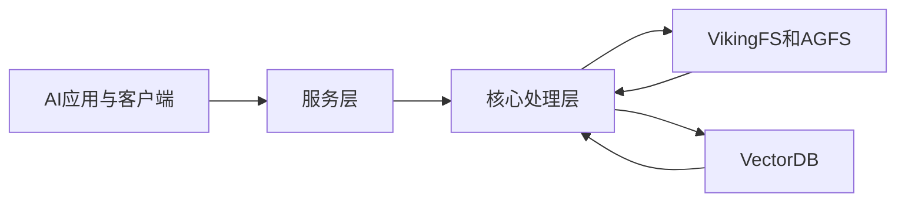
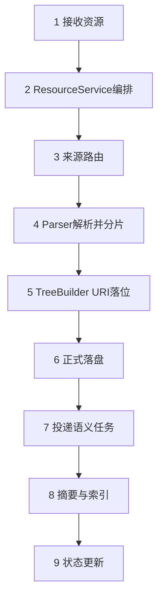
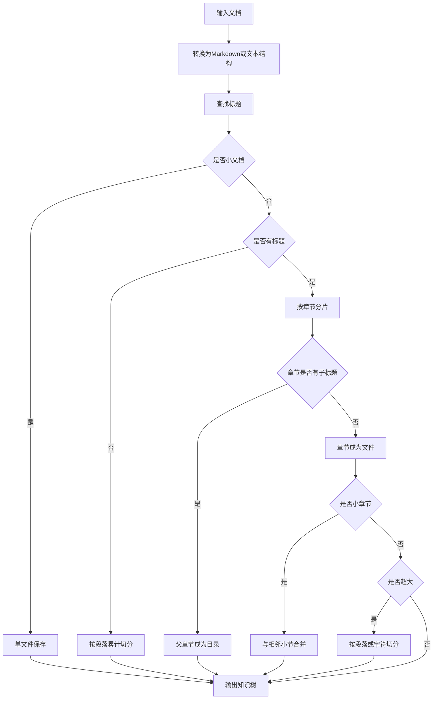
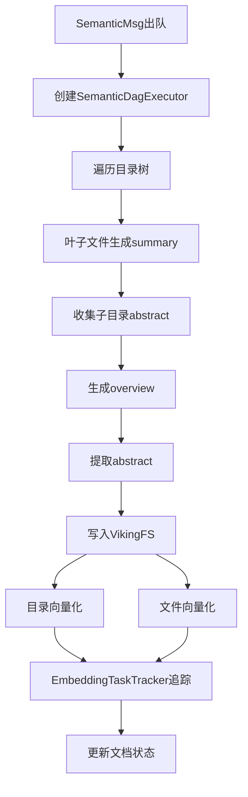
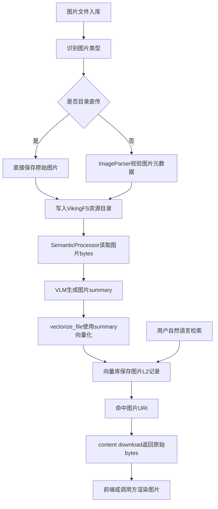
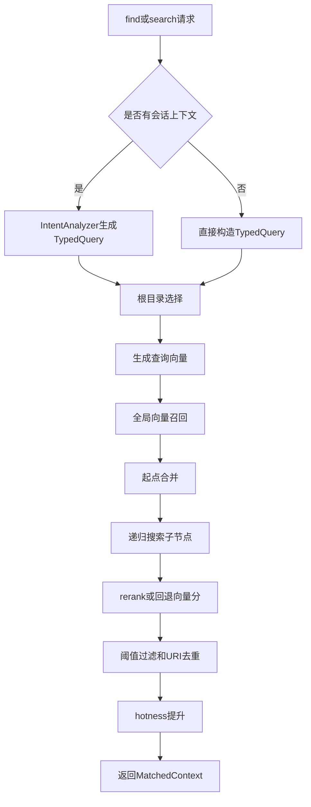

# OpenViking 文档入库、分片、检索与排序流程说明

> 可编辑版 Markdown  
> 目的：通过图、流程、规则和源码映射，说明 OpenViking 从文档入库到检索排序的完整处理过程。

## 0. 文档定位

OpenViking 的处理流程不是“上传文档后直接向量化”，而是：

1. 先接收资源请求；
2. 解析不同来源的文档、网页、目录、代码仓库或媒体；
3. 将内容按自然语义层级分片成知识树；
4. 写入 VikingFS/AGFS；
5. 异步生成 L0/L1 摘要；
6. 写入向量索引；
7. 检索时再通过意图分析、全局召回、递归搜索、rerank 和热度融合完成排序。

本文重点说明：

- 文档如何入库；
- 文档如何分片；
- L0/L1/L2 如何生成和向量化；
- `find/search` 如何检索；
- 候选结果如何排序；
- 每个流程对应哪些源码模块。

---

## 1. 总体架构



架构上，OpenViking 把上层 AI 应用、服务编排、核心处理管线和双层存储分离。

- **VikingFS/AGFS**：保存可审计、可读取的知识树和原始/转换后的 L2 内容。
- **VectorDB**：保存可检索的向量记录，包括层级、上下文类型、权限空间和分数信息。
- **服务层**：对外提供资源入库、内容读取、会话处理和检索接口。
- **核心处理层**：负责解析、分片、摘要、向量化、意图分析和排序。

---

## 2. 文档入库时序流程



### 2.1 入库阶段说明

| 阶段 | 关键模块 | 主要输入 | 主要输出 |
|---|---|---|---|
| 接入 | `resources.py`, `ResourceService` | `path`, `temp_file_id`, `to`, `parent`, `folder_path`, `wait` | 合法 source、`RequestContext`、处理参数 |
| 解析 | `UnifiedResourceProcessor`, `ParserRegistry`, Parser | 文件、URL、目录、ZIP、原始文本 | `ParseResult`, `temp_dir_path`, `source_format` |
| 落位 | `TreeBuilder`, `ResourceProcessor` | `temp_dir_path`, `scope`, `to/parent` | `root_uri`, `temp_uri`, `candidate_uri` |
| 正式落盘 | `ResourceProcessor`, `VikingFS/AGFS` | `root_uri`, `temp_uri`, lifecycle lock | 正式资源目录树 |
| 语义加工 | `Summarizer`, `SemanticQueue`, `SemanticProcessor`, `SemanticDag` | `SemanticMsg`, 目录树 | `.abstract.md`, `.overview.md`, 向量化任务 |
| 状态更新 | `KnowledgeDocumentRegistry` | `document_id`, embedding 结果 | `ready` 或 `failed` |

### 2.2 关键跟踪对象

| 对象 | 产生阶段 | 用途 |
|---|---|---|
| `temp_file_id` | `temp_upload` | 定位上传的临时文件 |
| `source_ref` | `ResourceService.add_resource` | 保留原始文件名或 URL |
| `root_uri` | `TreeBuilder / ResourceProcessor` | 正式知识树入口，后续可作为 `target_uri` |
| `temp_uri` | `ParseResult / BuildingTree` | 临时知识树位置，语义处理或增量同步时使用 |
| `document_id` | `KnowledgeDocumentRegistry` | 查询文档处理状态 |
| `SemanticMsg.id` | `SemanticQueue` | 跟踪语义处理和 embedding 任务 |
| `telemetry_id` | `run_operation / telemetry` | 关联 parse、finalize、wait、queue 等指标 |

---

## 3. 分片机制

OpenViking 的分片主要发生在 Parser 阶段。系统优先保持文档自然结构，而不是简单按固定长度硬切。

### 3.1 分片决策流程



### 3.2 分片规则表

| 判断条件 | 处理方式 | 输出形态 |
|---|---|---|
| 文档较小 | 估算 token `<= max_section_size`，且字符数 `<= max_section_chars` | 保存为单个 L2 文件 |
| 无标题的大文档 | 按空行分段，累计 token/字符超过限制时切分 | `{文档名}_1.md`, `{文档名}_2.md` |
| 有标题的大文档 | 识别最高层标题作为一级分片，保留标题层级 | 标题对应文件或目录 |
| 章节有子标题 | 父章节成为目录，直接内容作为虚拟 section，子标题继续递归 | 目录 + 子文件/子目录 |
| 小章节 | 小于 `DEFAULT_MIN_SECTION_TOKENS`，进入 pending，和相邻小节合并 | merged 文件或 `{first}_{count}more` 文件 |
| 超大章节且无子标题 | 按段落切分；单段过长时按 `max_section_chars` 强制切 | `{章节名}_1.md`, `{章节名}_2.md` |
| 文件名过长或重复 | sanitize 后截断，并用 hash 后缀保证唯一 | 稳定、可落盘的 URI segment |

### 3.3 分片相关配置和常量

| 配置/常量 | 当前口径 | 说明 |
|---|---|---|
| `ParserConfig.max_section_size` | 默认 1000 tokens | 超过后触发分片；`MarkdownParser` 内部兜底常量为 1024 |
| `DEFAULT_MIN_SECTION_TOKENS` | 512 tokens | 小于该值的章节优先合并，避免碎片过小影响检索 |
| `ParserConfig.max_section_chars` | 默认 6000 字符 | 硬性字符上限，防止 token 估算误差导致超大文件 |
| token 估算 | CJK 字符约 0.7 token，其他非空白字符约 0.3 token | 用于分片决策，不等同于模型 tokenizer 精确计数 |
| `PREVIEW_ORDER_FILENAME` | `.preview-order.json` | 记录生成的 `markdown_paths`，便于预览和顺序恢复 |

### 3.4 PDF / Office 如何进入分片

PDF 和 Office 文档不会绕过分片逻辑。

- PDF 解析会尽量通过书签或字体分析识别标题，并把标题注入为 Markdown heading。
- Word、Excel、PowerPoint 等办公文档会先转换为可读文本或表格结构。
- 转换后的文本再进入统一的 Markdown/文本分片逻辑。

---

## 4. L0 / L1 / L2 语义层与向量化

分片只产生 L2 内容树。真正用于检索的 L0/L1 摘要和向量索引由 `SemanticProcessor / SemanticDag` 异步生成。

### 4.1 语义加工流程



### 4.2 三层上下文

| 层级 | 物理位置/记录 | 向量化文本 | 检索作用 |
|---|---|---|---|
| L0 | 每个目录的 `.abstract.md` 对应一条目录向量记录 | 短摘要 `abstract` | 快速粗召回，定位相关知识区域 |
| L1 | 每个目录的 `.overview.md` 对应一条目录向量记录 | 目录 `overview` | 辅助目录导航和重排，理解子节点结构 |
| L2 | 分片后的正文文件、代码文件、媒体摘要文件 | summary 或原文截断内容 | 最终命中的证据片段和回答上下文 |

### 4.3 向量化策略

- 目录节点会生成两条记录：L0 abstract 和 L1 overview。
- 文本文件默认优先使用摘要进行向量化，避免长文档直接嵌入导致输入过长。
- 如果配置要求使用原文，会读取原文件并按 `embedding.max_input_chars` 截断。
- 非文本文件使用摘要进行向量化。
- `skip_vectorization=true` 时只生成 L0/L1 文本，不写向量索引。
- 向量记录会写入 `context_type`、`account_id`、`owner_space`、`level`、`parent_uri`、`active_count` 等 metadata。

### 4.4 图片索引、检索与渲染逻辑

图片文件在 OpenViking 中不是按“原始像素向量”直接入库检索，而是先保留原始图片文件，再通过 VLM 生成图片语义摘要，最后把图片摘要作为文本写入统一的向量索引。因此，图片可以被自然语言问题检索到，但命中能力取决于图片摘要是否覆盖了用户查询中的对象、文字、场景和业务语义。



| 阶段 | 处理逻辑 | 产物 | 关键实现 |
|---|---|---|---|
| 图片识别 | 根据扩展名或 `source_format` 判断 image/audio/video | 图片类型 | `get_media_type` |
| 图片保存 | 图片原始 bytes 写入 VikingFS。独立图片资源会落到 `viking://resources/images/{YYYYMMDD}`，目录导入时可按原目录结构保存 | 原始图片文件 URI | `ImageParser`, `DirectoryParser`, `TreeBuilder` |
| 元数据提取 | `ImageParser` 使用 PIL 校验图片并提取 `width`、`height`、`format` 等基础信息 | 图片基础 metadata | `openviking/parse/parsers/media/image.py` |
| 图片摘要 | 语义加工阶段读取图片 bytes，调用 VLM 按 `parsing.image_summary` prompt 生成自然语言摘要 | `{"name": 文件名, "summary": 图片摘要}` | `generate_image_summary` |
| 图片索引 | `vectorize_file` 判断为非文本文件后，仅在存在 summary 时把 summary 写入 `Vectorize(text=summary)` | 图片 L2 向量记录 | `openviking/utils/embedding_utils.py` |
| 图片检索 | `find/search` 仍走统一的 `HierarchicalRetriever`，通过查询向量匹配图片摘要向量 | 命中的图片 URI 和分数 | `openviking/storage/retrieval` |
| 图片渲染 | 后端不负责把图片渲染成页面，只通过 `/api/v1/content/download?uri=...` 返回原始 bytes；前端或调用方根据文件名、MIME 或二进制内容进行显示 | 可下载或可预览图片内容 | `openviking/server/routers/content.py` |

几个实现细节需要特别说明：

- `ImageParser.parse()` 当前只做原图保存和基础 metadata 提取，不在解析阶段做 OCR 或 VLM 内容理解。
- 图片内容理解发生在语义加工阶段，由 `SemanticProcessor._generate_single_file_summary()` 识别图片类型后调用 `generate_image_summary()`。
- 目录导入默认 `directly_upload_media=true`，图片会绕过 `ImageParser` 直接保存原始文件；后续语义加工仍会根据文件扩展名识别图片并生成摘要。
- SVG 目前不进入 VLM 识别流程，会返回“格式不支持 VLM”的兜底摘要。
- 如果 VLM 调用失败，会返回“Image summary generation failed”作为兜底摘要；这种记录仍可能入库，但检索效果会明显下降。
- 当前没有使用 CLIP 或多模态 embedding 对图片像素直接建索引，也没有把 OCR 作为图片入库的正式链路。代码中存在 OCR 和 VLM 描述的预留方法，但主流程未启用。

对业务文档而言，图片检索链路的效果取决于图片摘要质量。若图片中包含截图、表格、菜单、合同扫描件或技术图，建议后续增强为“VLM 摘要 + OCR 文本 + 图片元数据”的组合摘要，再进入 `vectorize_file`，这样能同时支持场景检索、文字检索和文件定位。

---

## 5. 检索流程

OpenViking 提供 `find` 和 `search` 两类语义检索。

- `find`：不依赖会话上下文，直接把用户 query 包装成一个 `TypedQuery`。
- `search`：可读取 session 的 `latest_archive_overview` 和最近消息，通过 `IntentAnalyzer` 生成多个 `TypedQuery`。

### 5.1 检索与排序流程图



### 5.2 接口差异

| 接口 | 是否使用会话 | TypedQuery 来源 | 典型场景 |
|---|---|---|---|
| `find` | 否 | 直接构造单个 `TypedQuery` | 知识库搜索框、快速定位资料、单轮问答 |
| `search` | 可选 | 有 session 时由 `IntentAnalyzer` 生成 0-5 条 `TypedQuery`；无 session 时按目标类型构造 | 多轮对话、智能投标、复杂客服问题 |
| `grep/glob` | 否 | 不走向量召回 | 精确文本查找、路径匹配、调试定位 |

### 5.3 检索步骤展开

| 检索步骤 | 输入 | 处理逻辑 | 输出 |
|---|---|---|---|
| 目标类型推断 | `target_uri` 或 `context_type` | 通过 URI 判断 resource/memory/skill；无 `target_uri` 时可搜索所有类型 | `TypedQuery.context_type` |
| 权限过滤 | `RequestContext` | 向量过滤 `account_id`、`owner_space`；resources 可账号共享，memory/skill 按用户或 agent 空间隔离 | `scope_filter` |
| 全局向量召回 | query dense/sparse vector | `search_global_roots_in_tenant` 在 L0/L1/L2 中找候选 | `global_results` |
| 起点合并 | `root_uris + global_results` | L0/L1 作为递归起点，L2 作为初始候选；thinking 模式可先 rerank 起点 | `starting_points`, `initial_candidates` |
| 递归子节点搜索 | 当前目录 URI | `PathScope depth=1` 搜索直接子节点；目录进入优先队列，L2 为终止命中 | `collected_by_uri` |
| 收敛判断 | 当前 topK URI 集合 | topK 连续不变且达到 limit，最多 3 轮后停止 | 候选列表 |
| 结果转换 | 候选记录 | 读取 related URI 的 L0 摘要，补 L0/L1 后缀，构造 `MatchedContext` | `FindResult` |

---

## 6. 排序与打分规则

OpenViking 的排序不是单一向量分数。系统会使用：

- 向量分；
- rerank 分数；
- 父级分数传播；
- 阈值过滤；
- URI 去重；
- hotness 热度融合。

### 6.1 排序公式

```text
局部候选分数:
local_score = rerank_score if rerank 可用且 mode=thinking else vector_score

递归传播分数:
final_score = alpha * local_score + (1 - alpha) * parent_score
alpha = SCORE_PROPAGATION_ALPHA = 0.5

阈值过滤:
final_score > score_threshold
或 score_gte=true 时 final_score >= score_threshold

最终展示分数:
display_score = (1 - HOTNESS_ALPHA) * semantic_score + HOTNESS_ALPHA * hotness_score
HOTNESS_ALPHA = 0.2
```

### 6.2 排序因子

| 排序因子 | 来源 | 作用 |
|---|---|---|
| `vector_score` | 向量库 dense/sparse/hybrid 搜索返回的 `_score` | 基础相似度，用于全局召回和子节点召回 |
| `rerank_score` | `RerankClient.rerank_batch(query, documents)` | thinking 模式下重排候选摘要，提高语义贴合度 |
| `parent_score` | 当前进入目录的分数 | 通过分数传播让高相关目录下的子节点获得合理加权 |
| `score_threshold` | 调用参数或 `rerank_config.threshold` | 过滤低分候选，控制噪声 |
| `hotness_score` | `active_count + updated_at` | 常用、近期更新的上下文获得轻微提升 |
| `dedup by URI` | `collected_by_uri` | 同一 URI 多次命中时保留最高 `final_score` |
| `relations` | VikingFS relation graph | 最终结果带最多 5 个相关节点摘要，扩展上下文 |

### 6.3 Rerank 失败时的处理

如果 rerank 服务异常、返回长度不一致或未配置，系统会：

1. 记录 warning；
2. 回退到向量分数；
3. 继续返回检索结果。

这意味着检索质量可能下降，但服务不会因为重排失败而不可用。

### 6.4 为什么要分层排序

| 原因 | 解释 |
|---|---|
| 避免只命中孤立碎片 | L0/L1 先定位相关知识区域，再进入子节点，能保留文档结构和上下文关系 |
| 降低大库搜索成本 | 全局召回只选起点，递归搜索只展开高分目录，减少无关节点遍历 |
| 改善答案可解释性 | `MatchedContext` 保留 `level`、`uri`、`abstract`、`relations`，方便追溯来源 |
| 支持复杂任务 | `search` 可把一个问题拆成多个 `TypedQuery`，分别检索资源、记忆和技能 |

---

## 7. 端到端示例

示例：上传“智能投标产品手册.docx”并问：“这份材料里有没有酒店行业案例？”

### 7.1 入库过程

```text
1. temp_upload -> temp_file_id
2. add_resource(wait=true, instruction=面向投标提取产品能力、案例、资质)
3. WordParser 转换内容，MarkdownParser 分片成章节树
4. TreeBuilder 生成 root_uri=viking://resources/投标资料/智能投标产品手册
5. SemanticDag 生成每个目录的 .abstract.md/.overview.md
6. VectorDB 写入 L0/L1/L2 向量记录
```

### 7.2 检索过程

```text
1. search(query, session_id) 读取会话摘要和最近消息
2. IntentAnalyzer 生成 resource 类型 TypedQuery
3. 全局召回命中“行业案例”相关 L0/L1
4. 递归进入该目录，召回酒店案例 L2 分片
5. rerank 提升与“酒店行业案例”最相关的分片
6. 返回 MatchedContext，供 RAG 生成答案并引用来源
```

### 7.3 需要跟踪的对象

| 跟踪对象 | 产生阶段 | 用途 |
|---|---|---|
| `root_uri` | `TreeBuilder / ResourceProcessor` | 正式知识树入口，检索时可作为 `target_uri` |
| 分片文件 URI | `MarkdownParser / Parser` | L2 内容节点，最终答案引用来源 |
| `.abstract.md` | `SemanticDag` | L0 快速召回文本 |
| `.overview.md` | `SemanticDag` | L1 目录导航和重排文本 |
| `SemanticMsg.id` | `Summarizer / SemanticQueue` | 关联语义处理和 embedding 任务 |
| `document_id` | `KnowledgeDocumentRegistry` | 查询 `ready/failed` 处理状态 |
| `MatchedContext.score` | `HierarchicalRetriever` | 最终排序后的可解释检索分数 |

---

## 8. 源码映射

| 主题 | 关键源码 | 说明 |
|---|---|---|
| 资源接入 | `openviking/server/routers/resources.py` | `temp_upload`、`add_resource` 路由和请求参数 |
| 入库编排 | `openviking/service/resource_service.py` | URI 约束、文档登记、wait、watch task |
| 执行处理 | `openviking/utils/resource_processor.py` | 解析、TreeBuilder、正式落盘、Summarizer 投递 |
| 来源路由 | `openviking/utils/media_processor.py` | URL、目录、文件、ZIP、原始文本路由 |
| 分片核心 | `openviking/parse/parsers/markdown.py` | 标题识别、小节合并、超大段落拆分、preview-order |
| 解析器选择 | `openviking/parse/registry.py` | 根据扩展名、URL 类型选择 parser |
| 语义 DAG | `openviking/storage/queuefs/semantic_dag.py` | 自底向上生成 `.overview.md` / `.abstract.md`，调度向量化 |
| 向量化 | `openviking/utils/embedding_utils.py` | 目录 L0/L1 和文件 L2 的 `Context / EmbeddingMsg` |
| 检索入口 | `openviking/storage/viking_fs.py` | `find/search`、`IntentAnalyzer` 调用和结果聚合 |
| 意图分析 | `openviking/retrieve/intent_analyzer.py` | 会话上下文转 `TypedQuery` |
| 分层召回排序 | `openviking/retrieve/hierarchical_retriever.py` | 全局召回、递归搜索、rerank、分数传播、hotness |
| 向量过滤 | `openviking/storage/viking_vector_index_backend.py` | tenant filter、`PathScope`、`target_directories`、`owner_space` |

---

## 9. 可以继续补充的内容

后续如果要把本文扩展成更完整的技术说明，可以继续补：

- 记忆处理流程；
- 智能客服端到端流程；
- 智能投标端到端流程；
- 多租户权限边界；
- 异步任务、失败重试和状态监控；
- 部署架构和配置说明。
